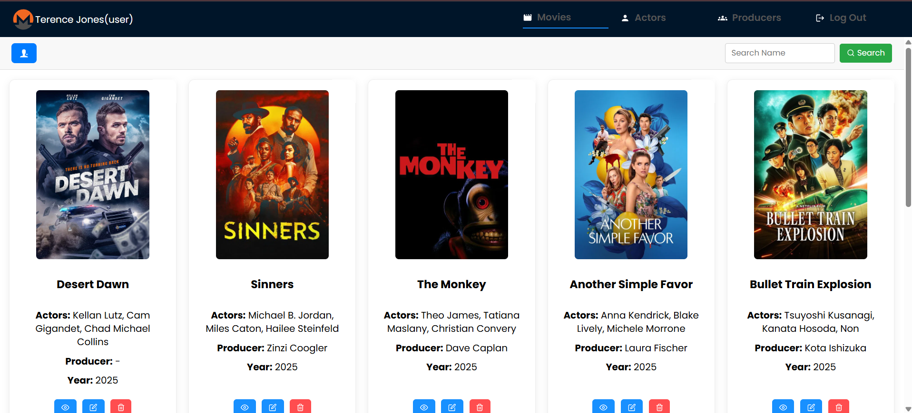
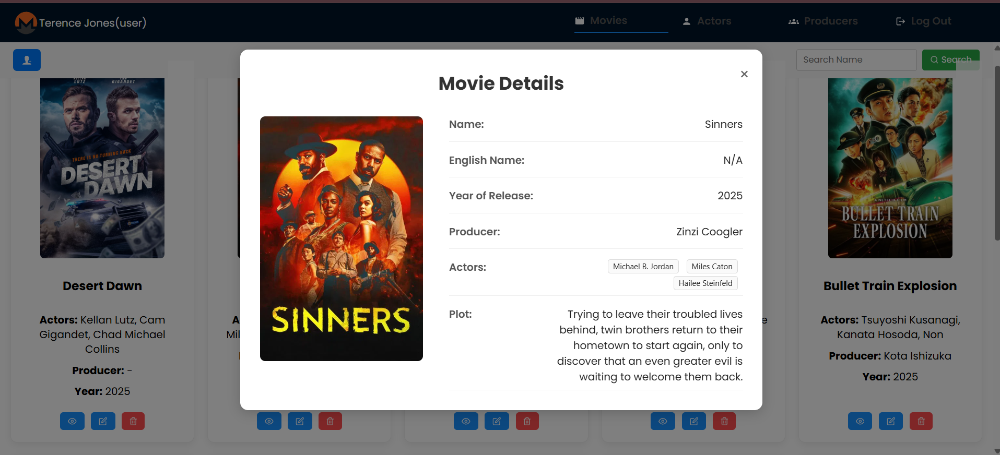
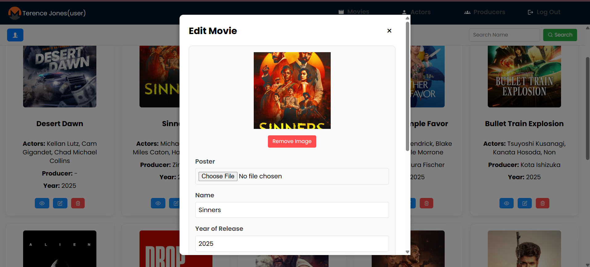
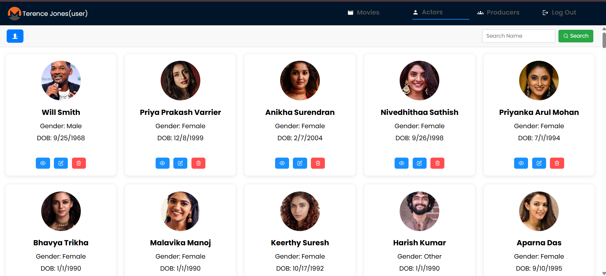
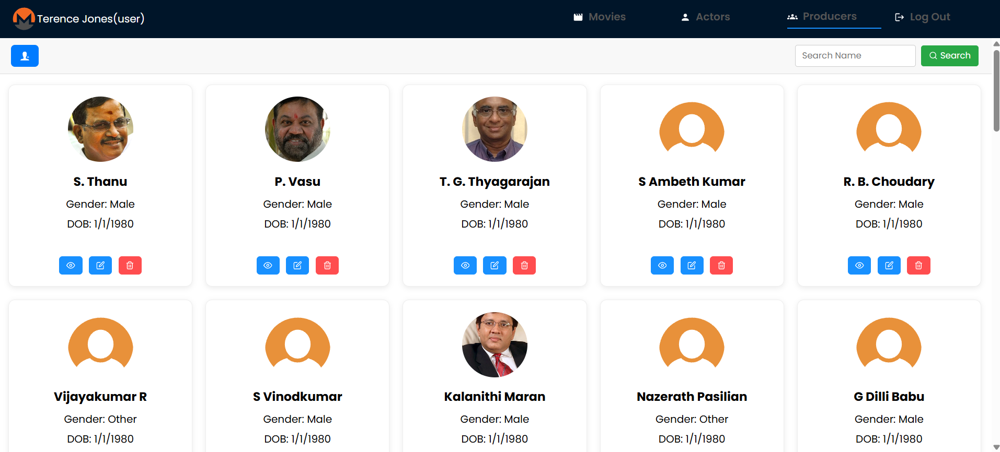

# CineVault

CineVault is a full-stack movie management application for managing movies, actors, and producers through an authenticated web interface.

The application is built with React and Node.js/Express, uses PostgreSQL in production with Knex.js for database access, and integrates Cloudinary for image and movie-poster storage.

## Live Application

**Frontend:** https://cinevault-fullstack.vercel.app

**Backend API:** https://cinevault-backend-o6ru.onrender.com

> The backend is hosted on Render's free tier and may take a short time to respond after a period of inactivity.

## Screenshots

### Movies


### Movie Details


### Edit Movie


### Actors


### Producers


## Features

### Authentication
- User registration and login
- JWT-based authentication
- Password hashing with bcrypt
- Protected application routes
- Logout functionality

### Movie Management
- View movie details
- Search movies
- Add movies
- Edit movies
- Soft delete movies
- Paginated movie listing
- Assign a producer to a movie
- Associate multiple actors with a movie
- Upload and replace movie posters

### Actor Management
- View actor details
- Search actors
- Add actors
- Edit actors
- Delete actors
- Upload and replace actor images

### Producer Management
- View producer details
- Search producers
- Add producers
- Edit producers
- Delete producers
- Upload and replace producer images

### Media Management
- Cloudinary integration for images and movie posters
- Automatic cleanup of replaced actor and producer images
- Automatic cleanup of images when actors or producers are deleted
- Automatic cleanup of replaced movie posters
- Movie posters retained when movies are soft deleted

## Tech Stack

### Frontend
- React
- Vite
- Redux Toolkit
- React Router
- Axios
- Ant Design
- CSS

### Backend
- Node.js
- Express.js
- REST APIs
- JWT
- bcrypt
- Multer

### Database
- PostgreSQL — production
- SQLite — local development
- Knex.js — query builder and migrations

### Cloud & Deployment
- Cloudinary — image and poster storage
- Vercel — frontend deployment
- Render — backend deployment
- Render PostgreSQL — production database

## Application Flow

```text
Register / Login
       |
       v
JWT Authentication
       |
       v
CineVault Dashboard
       |
       +----------------+
       |       |        |
       v       v        v
     Movies  Actors  Producers
       |       |        |
       +--- View / Add / Edit / Delete
       |
       v
Express REST API
       |
       +---------------------+
       |                     |
       v                     v
PostgreSQL               Cloudinary
Application Data         Images / Posters
       |
       v
Logout
```

## Project Structure

```text
cinevault-fullstack/
├── client/                 # React frontend
│   └── src/
│       ├── app/
│       ├── common/
│       ├── components/
│       ├── features/
│       ├── pages/
│       └── services/
│
├── config/                 # Backend configuration
├── database/
│   ├── migrations/         # Knex database migrations
│   └── seeds/              # Development seed data
│
├── src/                    # Express backend source
├── knexfile.js             # Knex configuration
├── server.js               # Backend entry point
└── package.json
```

## Local Development

### 1. Clone the repository

```bash
git clone https://github.com/jones122903/cinevault-fullstack.git
cd cinevault-fullstack
```

### 2. Install backend dependencies

```bash
npm install
```

### 3. Install frontend dependencies

```bash
cd client
npm install
cd ..
```

### 4. Configure environment variables

Create the required environment files using the project's `.env.example` as a reference.

Do not commit credentials or API secrets to the repository.

### 5. Run database migrations

```bash
npx knex migrate:latest
```

### 6. Start the backend

```bash
npm run dev
```

### 7. Start the frontend

Open another terminal:

```bash
cd client
npm run dev
```

The frontend and backend will then run locally using the configured development environment.

## Database Design

CineVault uses relational data for:

- Users
- Movies
- Actors
- Producers
- Movie–Actor relationships

Movies reference producers, while the movie-actor relationship supports associating multiple actors with multiple movies.

## API Architecture

The React frontend communicates with the Express backend through REST APIs.

The backend is responsible for:

- Authentication and authorization
- Request validation
- Movie, actor, and producer operations
- PostgreSQL database access through Knex.js
- Cloudinary media uploads and asset lifecycle management

## Deployment

The production application uses:

```text
React / Vite
     |
     | Vercel
     v
Frontend
     |
     | REST API
     v
Node.js / Express
     |
     | Render
     v
Backend
     |
     +-------------------+
     |                   |
     v                   v
PostgreSQL           Cloudinary
Database             Media Storage
```

## Author

**Terence Jones C**

- GitHub: https://github.com/jones122903
- LinkedIn: https://www.linkedin.com/in/terencejonesc/
